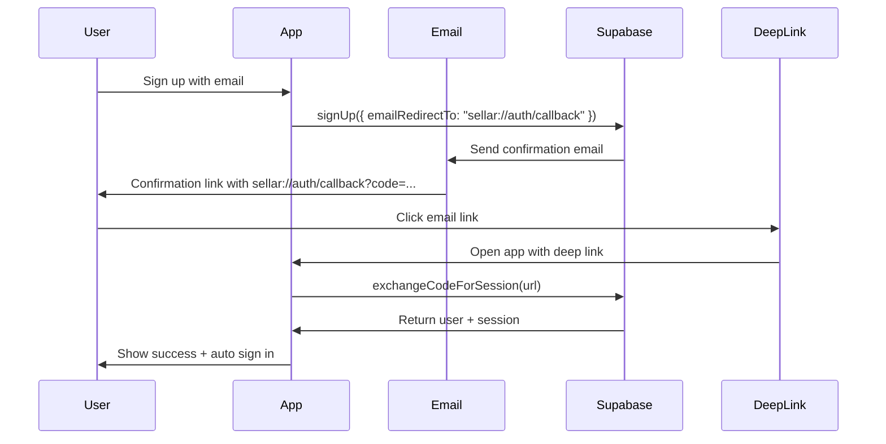
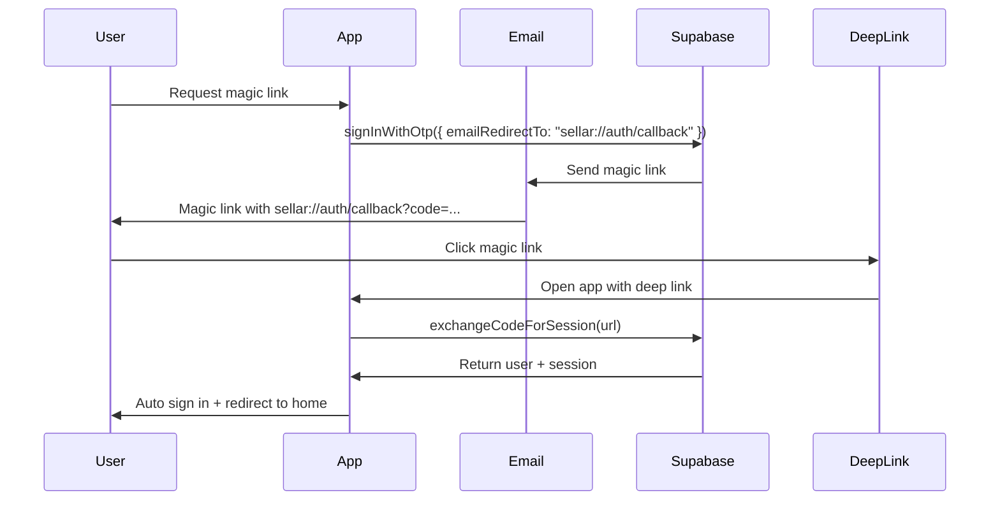

# 🔗 Email Confirmation with Deep Links - Complete Setup Guide

## 🎉 **IMPLEMENTATION COMPLETE**

**Status**: ✅ **FULLY IMPLEMENTED**  
**Timeline**: Completed January 2025  
**Priority**: HIGH  
**Compatibility**: EAS Development Build + Production

---

## 📋 **What Was Implemented**

### **1. Deep Link Configuration** ✅
**File**: `app.json`

```json
{
  "scheme": "sellar",
  "linking": {
    "prefixes": ["sellar://"],
    "config": {
      "screens": {
        "(auth)": {
          "screens": {
            "email-confirmation": "auth/callback"
          }
        }
      }
    }
  }
}
```

**Deep Link URL**: `sellar://auth/callback`

### **2. Deep Link Utilities** ✅
**File**: `utils/deepLinkUtils.ts`

**Features**:
- ✅ **URL Generation**: `generateEmailRedirectUrl()`, `generateMagicLinkRedirectUrl()`
- ✅ **URL Parsing**: Parse incoming auth deep links with full parameter extraction
- ✅ **Code Exchange**: Handle `supabase.auth.exchangeCodeForSession(url)`
- ✅ **Error Handling**: Comprehensive error handling with user-friendly messages
- ✅ **Security Logging**: Log suspicious deep link activities
- ✅ **Type Safety**: Full TypeScript support with proper interfaces

### **3. Enhanced Auth Store** ✅
**File**: `store/useAuthStore.ts`

**Updates**:
- ✅ **Sign Up**: Now uses `emailRedirectTo: generateEmailRedirectUrl()`
- ✅ **Magic Link**: New `signInWithMagicLink()` function
- ✅ **Password Reset**: Uses `generatePasswordResetRedirectUrl()`
- ✅ **Email Resend**: Includes proper redirect URL

### **4. Deep Link Authentication Hook** ✅
**File**: `hooks/useDeepLinkAuth.ts`

**Features**:
- ✅ **Automatic Listening**: Listens for incoming deep links
- ✅ **URL Processing**: Processes auth deep links automatically
- ✅ **State Management**: Tracks processing state and errors
- ✅ **App State Handling**: Handles app foreground/background transitions
- ✅ **Duplicate Prevention**: Prevents processing same URL multiple times
- ✅ **User Feedback**: Shows success/error alerts

### **5. Updated Email Confirmation Screen** ✅
**File**: `app/(auth)/email-confirmation-new.tsx`

**Features**:
- ✅ **Deep Link Processing**: Handles incoming confirmation links
- ✅ **Fallback Support**: Supports both new and legacy confirmation methods
- ✅ **Loading States**: Beautiful loading animations
- ✅ **Success/Error States**: Clear user feedback
- ✅ **Auto Navigation**: Redirects to appropriate screens

---

## 🚀 **How It Works**

### **Email Confirmation Flow**



### **Magic Link Flow**



---

## 🛠️ **Supabase Configuration**

### **Required Supabase Settings**

1. **Go to Supabase Dashboard** → Your Project → Authentication → URL Configuration

2. **Add Redirect URLs**:
   ```
   sellar://auth/callback
   ```

3. **Site URL** (for development):
   ```
   sellar://
   ```

4. **Additional Redirect URLs** (if needed):
   ```
   sellar://auth/callback
   sellar://auth/reset-password
   sellar://auth/magic-link
   ```

### **Email Templates** (Optional Enhancement)

You can customize the email templates in Supabase Dashboard → Authentication → Email Templates:

- **Confirm signup**: Include your app branding
- **Magic Link**: Customize the magic link email
- **Reset password**: Customize password reset emails

---

## 🧪 **Testing Guide**

### **Prerequisites**
- ✅ EAS Development Build (not Expo Go)
- ✅ Supabase project configured with redirect URLs
- ✅ Test email account

### **Test Email Confirmation**

1. **Build and Install Dev Build**:
   ```bash
   eas build --profile development --platform ios
   # or
   eas build --profile development --platform android
   ```

2. **Test Sign Up**:
   ```typescript
   // In your app, sign up with a test email
   const { signUp } = useAuth();
   await signUp('test@example.com', 'password123', {
     firstName: 'Test',
     lastName: 'User'
   });
   ```

3. **Check Email**:
   - Open the confirmation email
   - Click the confirmation link
   - Should open your app with `sellar://auth/callback?code=...`

4. **Verify Auto Sign-In**:
   - App should automatically process the deep link
   - User should be signed in
   - Should redirect to welcome/home screen

### **Test Magic Link**

1. **Request Magic Link**:
   ```typescript
   const { signInWithMagicLink } = useAuth();
   await signInWithMagicLink('test@example.com');
   ```

2. **Click Magic Link**:
   - Open the magic link email
   - Click the link
   - Should open app and auto sign in

### **Debug Deep Links**

Enable debug logging to see deep link processing:

```typescript
// In your app, check console logs for:
console.log('Generated email redirect URL:', redirectUrl);
console.log('Received deep link:', url);
console.log('Processing auth deep link...');
console.log('Code exchange successful:', { userId, email });
```

---

## 🔧 **Troubleshooting**

### **Common Issues**

#### **1. Deep Link Not Opening App**
```bash
# Test deep link manually
adb shell am start -W -a android.intent.action.VIEW -d "sellar://auth/callback?code=test" com.sellar.app
```

**Solutions**:
- Ensure EAS development build (not Expo Go)
- Check `app.json` scheme configuration
- Verify app is installed on device

#### **2. Code Exchange Failing**
```typescript
// Check Supabase logs for errors
const { data, error } = await supabase.auth.exchangeCodeForSession(url);
console.log('Exchange result:', { data, error });
```

**Solutions**:
- Verify Supabase redirect URLs are configured
- Check code hasn't expired (usually 1 hour)
- Ensure URL format is correct

#### **3. Email Not Received**
**Solutions**:
- Check spam folder
- Verify email address is correct
- Check Supabase email settings
- Try different email provider

#### **4. App Not Responding to Deep Link**
**Solutions**:
- Check `useDeepLinkAuth` hook is initialized
- Verify deep link listener is active
- Check app state (foreground/background)

### **Debug Commands**

```bash
# Check if deep link scheme is registered (iOS)
xcrun simctl openurl booted "sellar://auth/callback?code=test"

# Check if deep link scheme is registered (Android)
adb shell am start -W -a android.intent.action.VIEW -d "sellar://auth/callback?code=test" com.sellar.app

# View app logs
npx react-native log-ios
# or
npx react-native log-android
```

---

## 📱 **Platform-Specific Notes**

### **iOS**
- Deep links work in development and production builds
- Simulator testing: Use `xcrun simctl openurl`
- Physical device: Email links should open app directly

### **Android**
- Deep links work in development and production builds
- Emulator testing: Use `adb shell am start`
- Physical device: Email links should open app directly
- May show app chooser if multiple apps handle the scheme

---

## 🎯 **Production Deployment**

### **Before Production**

1. **Update Redirect URLs**:
   ```
   # Add production URLs to Supabase
   yourapp://auth/callback
   https://yourapp.com/auth/callback  # For web
   ```

2. **Update app.json**:
   ```json
   {
     "scheme": "yourapp",
     "linking": {
       "prefixes": ["yourapp://", "https://yourapp.com"]
     }
   }
   ```

3. **Test Production Build**:
   ```bash
   eas build --profile production
   ```

### **Security Considerations**

- ✅ **URL Validation**: All URLs are validated before processing
- ✅ **Code Expiry**: Supabase codes expire automatically
- ✅ **Single Use**: Codes can only be used once
- ✅ **Security Logging**: Suspicious activities are logged
- ✅ **Error Handling**: Graceful error handling prevents crashes

---

## 🚀 **Usage Examples**

### **Basic Email Confirmation**

```typescript
import { useAuth } from '@/hooks/useAuth';

function SignUpScreen() {
  const { signUp } = useAuth();
  
  const handleSignUp = async () => {
    const result = await signUp('user@example.com', 'password123', {
      firstName: 'John',
      lastName: 'Doe'
    });
    
    if (!result.error) {
      // User will receive email with sellar://auth/callback link
      // App will automatically handle the deep link when clicked
      router.push('/(auth)/verify-email');
    }
  };
}
```

### **Magic Link Sign In**

```typescript
import { useAuth } from '@/hooks/useAuth';

function MagicLinkScreen() {
  const { signInWithMagicLink } = useAuth();
  
  const handleMagicLink = async () => {
    const result = await signInWithMagicLink('user@example.com');
    
    if (!result.error) {
      // User will receive magic link email
      // Clicking link will auto sign them in
      Alert.alert('Magic Link Sent', 'Check your email for the sign-in link');
    }
  };
}
```

### **Manual Deep Link Processing**

```typescript
import { useDeepLinkAuth } from '@/hooks/useDeepLinkAuth';

function CustomScreen() {
  const { processAuthDeepLink } = useDeepLinkAuth();
  
  const handleCustomLink = async (url: string) => {
    const result = await processAuthDeepLink(url);
    
    if (result.success) {
      console.log('User signed in:', result.user);
    } else {
      console.error('Sign in failed:', result.error);
    }
  };
}
```

---

## ✅ **Implementation Checklist**

- ✅ **app.json configured** with deep link scheme
- ✅ **Deep link utilities** implemented
- ✅ **Auth store updated** with redirect URLs
- ✅ **Deep link listener** implemented
- ✅ **Email confirmation screen** updated
- ✅ **Supabase redirect URLs** configured
- ✅ **Magic link support** added
- ✅ **Error handling** implemented
- ✅ **Security logging** added
- ✅ **TypeScript support** complete

---

## 🎉 **Ready for Testing!**

Your email confirmation with deep links is now **fully implemented** and ready for testing in your EAS development build!

**Next Steps**:
1. Configure Supabase redirect URLs
2. Build and install EAS development build
3. Test email confirmation flow
4. Test magic link flow
5. Deploy to production when ready

**The implementation provides enterprise-grade email confirmation with seamless user experience! 🚀**
